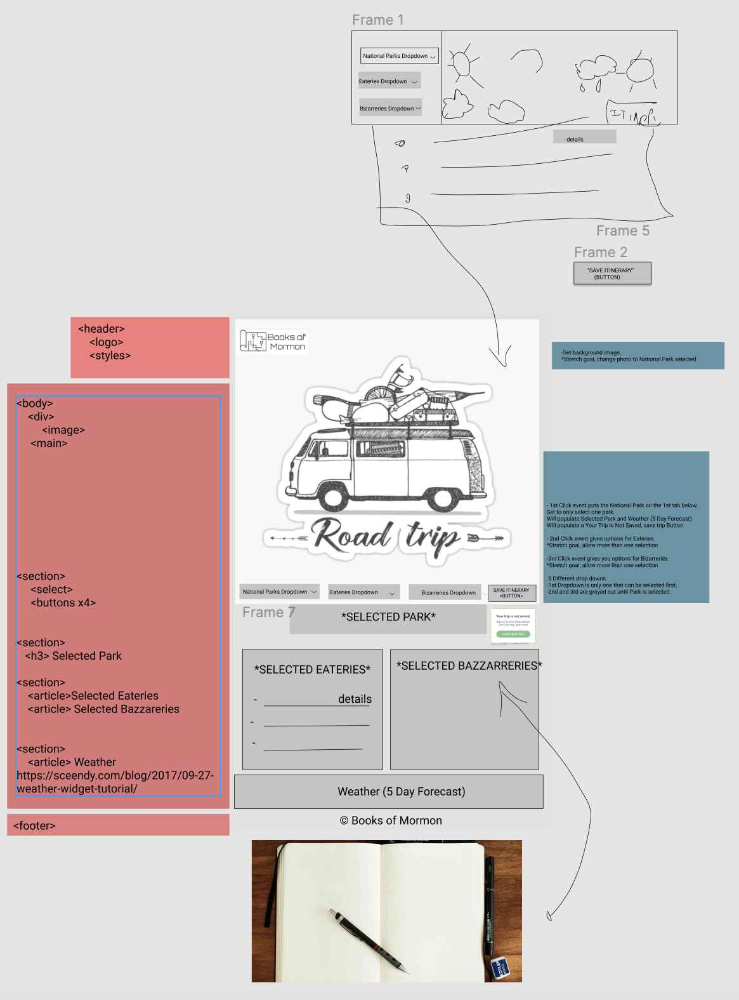

# Nutshell: The Information Dashboard by The Books of Mormon
## Overview
Holiday Road is a site for the minimalist looking to plan a quick trip in Tennessee. Our site allows your to choose a national park in Tennessee, show the weather for the park, and also allow you to add eateries and bizzarre attractions to your trip. 
## Target Audience


## Learning Objectives
1. Functions
2. APIs
3. Github
4. Objects
5. CSS/Flexbox
6. Array methods
7. Components
8. Handling user events
9. Implementing CRUD operations

## Planning Tools
1. Wireframe 

## Instructions for Holiday Road
Make sure you have Node.js and npm installed. After those are installed, make sure you use npm to install serve and json-server.
1. git clone the repository URL
2. ```cd``` into ```holiday-road-books-of-mormon```
3.  In your terminal, type ```serve``` to attain the local host web address
4. Go to the localhost address in your browser that serve is serving on and register an account

## Team: The Books of Mormon
- [Devon Cox](https://github.com/Devco2011)
- [Joseph Tidwell](https://github.com/joetid09)
- [Colin Arel](https://github.com/cArel116)
- [Tessa Steffen](https://github.com/TessaSoftEng)